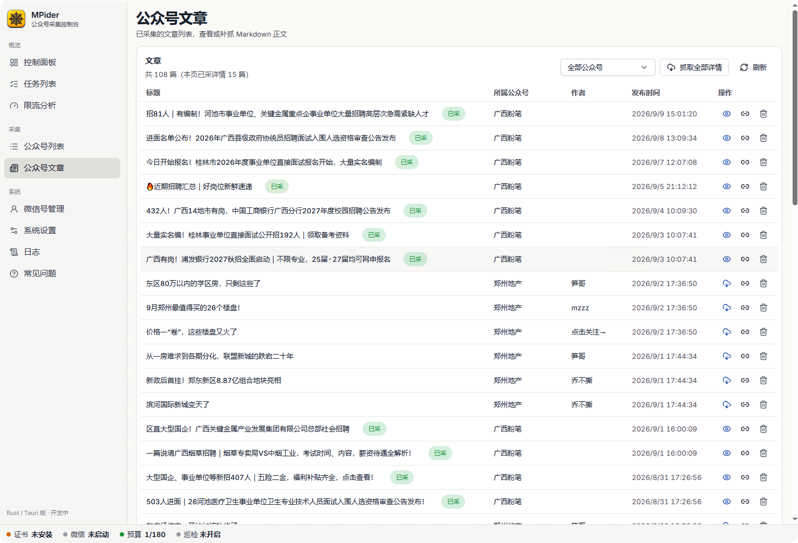
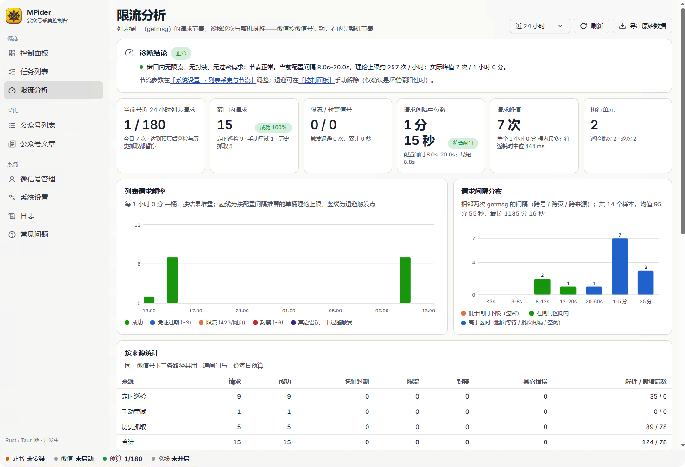
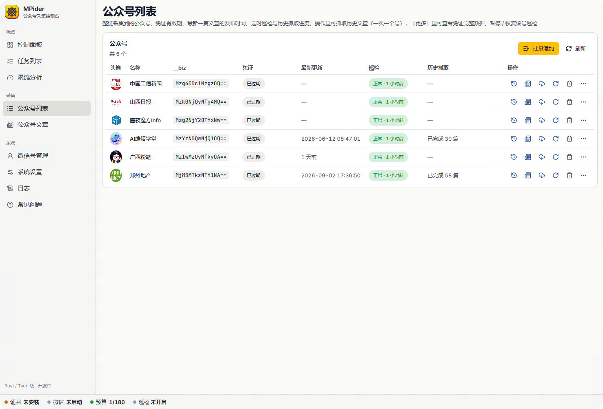
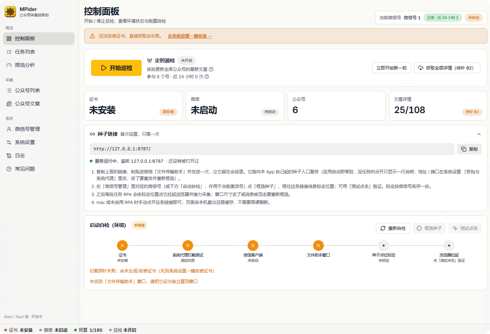
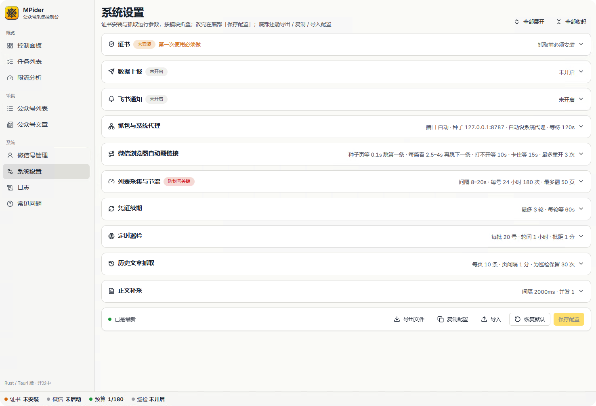

# MPider

微信公众号文章采集的桌面工具，Rust 核心 + Tauri 外壳，macOS / Windows。
**接口已失效，现作为实现与工程记录开源，供学习参考。**

---

## 一、现在是什么状态

| | |
|---|---|
| **能采到文章吗** | ❌ 不能。2026-09-10 起列表接口不再返回数据 |
| **是被封号了吗** | ❌ 不是。换全新账号、换机器、换公众号，结果都一样 |
| **软件能跑吗** | ✅ 能编译运行。抓凭证、脚本接力、正文转 Markdown 都正常，只有列表取不到数据 |
| **还会修吗** | ❌ 不会。已转为学习与经验分享用途，不再追查接口 |

失效的具体表现：请求照常返回 HTTP 200、`ret=0`、`errmsg="ok"`，但响应里
`general_msg_list`、`next_offset`、`real_type` 三个字段一并消失，`msg_count` 为 0。
微信既不报错也不给数据。

### 如果你是刚需

要的是稳定拿到公众号文章数据，而不是研究这件事怎么实现，那自建这条路不划算。
可以试试 [Mp2RSS](https://mp2rss.bugcode.dev/)：订阅公众号与 X 账号持续抓取，
文章永久留存，Open API / RSS / OPML / CLI 任选取数，不必用自己的账号承担风险。

---

## 二、时间线

| 日期 | 发生了什么 |
|---|---|
| 09-02 | Rust + Tauri 版本跑通，Windows 构建链路验证通过 |
| 09-04 | 放弃视觉识别定位，改为用户人工框选标定种子链接位置 |
| 09-06 | 首次撞上 `ret=-6`，判明是账号级限制而非凭证过期 |
| 09-08 ~ 09-09 | 三个账号分别在累计第 224 / 223 / 206 次请求时被限制，确认是**按微信号累计约 200 次 / 24 小时**的配额，与速率、出口 IP 无关 |
| 09-09 | 开源改造：移除内部任务源与代理池，加入多微信号管理与批量添加 |
| **09-10 中午** | **最后一次正常采集**：单次取到 10 条，响应体 22533 字节 |
| **09-10 下午** | **同一账号同一请求开始返回空响应** |
| 09-10 ~ 09-11 | macOS 支持补齐：人工模式 + 待命页自轮询，第一批之后无需再操作 |
| **09-11** | **交叉验证定案**：三个账号 × 两台机器 × 七个公众号，响应完全一致 |

定案的关键一步：第三个账号**从未触发过任何限制**，而它的**第一次**列表请求就是空响应。
账号级限制解释不了这个现象，因此指向服务端对接口本身的调整。

---

## 三、它是怎么工作的

微信公众号的文章列表接口需要一份登录态凭证，这份凭证只在微信内置浏览器里出现。
整套设计就是围绕「怎么拿到它、怎么用它」展开的四步：

```
① 抓凭证    本机自签根证书 + 本地 MITM 代理
            只解密微信内置浏览器发往 mp.weixin.qq.com 的流量
            微信主协议按 SNI 直通不碰（拦错会弄断微信）
                    ↓  从请求里取出 key / uin / pass_ticket
② 接力      往返回的文章 HTML 里注入一小段 JS
            页面停留几秒后自己跳到下一条链接
            浏览器于是自动逐条打开，一次拿到多个号的凭证
                    ↓
③ 回放      拿凭证直连微信服务器请求列表接口（不经代理、不开微信）
            按「最后发布时间」增量翻页，凭证过期集中续期后续采
                    ↓  ← 这一步自 2026-09-10 起取不到数据
④ 补正文    文章页是公开的，匿名抓取后转成 Markdown
```

怎么让浏览器打开第一条链接，两个平台做法不同：

- **Windows**：原生窗口操作。枚举窗口找到文件传输助手、置顶、按用户标定的坐标模拟点击。
- **macOS**：不申请自动化权限。第一批提示用户手动打开一篇文章，之后浏览器停在一个「待命页」上
  长轮询等任务，后续批次全自动。用 `fetch` 链而非定时器，避开 Chromium 对后台页的节流。

完整机制见 [`docs/how-it-works.md`](docs/how-it-works.md)。

---

## 四、界面

软件是一个 Tauri 桌面应用，下面几张图摄于本文所述接口失效之后，数据是失效前采到的。

**公众号文章**：采到的文章列表，正文可补抓为 Markdown。这一步走的是公开文章页，
不需要凭证，也是整条链路里唯一至今仍然可用的部分。



**限流分析**：每一次列表请求都留档了当时的影响因素，这一页把它们统计出来。
README 里那个「按微信号累计约 200 次 / 24 小时」的结论，就是从这些留档里推出来的。
请求间隔分布、按来源统计、退避触发点都在这里。



**公众号列表**：每个号的凭证有效期、最新一篇的发布时间、巡检与历史抓取进度。
凭证约 30 分钟过期，图中显示的都是已过期状态。



**控制面板**：启动自检把抓取需要的六个前置条件逐项摆出来（证书、代理拦截、微信客户端、
文件传输助手窗口、种子点位标定、浏览器拉起），缺哪项点哪项。图中是首次启动、尚未安装
证书时的样子，所以前四项都是未就绪。



**系统设置**：抓取节奏、凭证续期、巡检与历史抓取的参数都在这里，按模块折叠。
其中「列表采集与节流」是防封号的关键项。



---

## 五、这个仓库里值得一读的部分

| 主题 | 位置 |
|---|---|
| 本地 MITM 与**按 SNI 选择性直通**（拦错主机会弄断微信主协议） | `crates/core/src/capture.rs` |
| 从浏览器流量里提取会话凭证并按账号归属校验 | `crates/core/src/proxy_addon.rs` |
| **脚本注入接力**：往返回的 HTML 里注入 JS，让浏览器自己逐条打开链接 | `crates/core/src/relay.rs` |
| Windows 原生窗口操作（`EnumWindows` / `SetForegroundWindow` / `SendInput`）与人工框选标定 | `crates/core/src/rpa.rs` |
| macOS 无自动化权限下的**待命页长轮询**（用 `fetch` 链避开后台定时器节流） | `crates/core/src/seedserver.rs` |
| 系统代理的 RAII 守卫、进程退出兜底与启动残留清理 | `crates/core/src/sysproxy.rs` |
| **限流研究方法**：每次请求留档影响因素，事后统计归因（如何从三个样本推出配额按账号累计） | `crates/core/src/ratelimit.rs`、软件内「常见问题」页 |
| 文章 HTML → Markdown 的纯解析库（无网络依赖，可独立使用） | `crates/article-md` |

限流观测的完整记录，包括三个账号触发限制时的累计请求数、排除日历日 / 时间窗口 / 速率 / 出口 IP
的过程，保留在软件的「常见问题」页。

本仓库以 MIT 协议开源；`crates/article-md` 移植自 MIT 许可的 Python 项目 `wechat-article-parser`，
归属声明见 [`THIRD-PARTY-NOTICES.md`](THIRD-PARTY-NOTICES.md)。

---

> ⚠️ **若要编译运行本软件，请先了解**
> - 它会在本机**安装根证书、修改系统代理、模拟点击驱动微信客户端**，请只在专用机器上运行。
> - 只能采集公众号**公开发布**的文章；请使用自己的微信账号，遵守平台规则与当地法律法规。
> - 接口可用时期的观测：列表接口按账号限流（约每 24 小时 200 次），超出会暂时限制该微信号。
>   软件内置节制策略，但**不承诺不触发**，风险自负。
> - 第一节已说明列表采集不可用，请勿把本仓库当作可直接使用的采集工具。

## 功能

> 下列功能均已实现并可运行，其中**列表采集 / 定时巡检 / 抓取历史文章**依赖的接口自 2026-09-10 起取不到数据（见第一节），此处作为实现说明保留。

- **抓凭证**：本地 MITM（hudsucker + 自签 CA），微信主协议按 SNI 直通不碰，只解密公众号文章流量。
- **自动接力**：Windows 上把一条固定「种子链接」发进文件传输助手并框选标定，之后每批任务由软件模拟点击打开，文章页之间自动接力，无需人工点。macOS 是**人工模式**：第一批开始时软件提醒你在微信内置浏览器打开任意一篇公众号文章，打开一篇即自动接力其余；本批跑完，内置浏览器会自动停在一个「待命页」上，只要不关它，后续每批都自动接力、不再提醒。种子链接 / 框选 / 自检这些 Windows 专属的设置在 mac 上不显示，控制面板只有一张「待命页」状态卡。
- **列表采集**：`getmsg` 翻页，按「最后发布时间」增量，凭证过期集中续期后从断点续采。
- **正文补采**：公开页转 Markdown（`crates/article-md`），命中验证页先用对照链接确认再判限流。
- **批量添加公众号**：在「公众号列表」粘贴多条文章短链，软件直接访问文章页读出公众号名称与 biz 即刻建号（不开微信），之后由巡检采集。
- **定时巡检**：控制面板「开始巡检」后库里的公众号按轮自更新最新文章，轮状态持久化；巡检与历史抓取同一时刻只能跑一个。
- **抓取历史文章**：对单个公众号按条数 / 时间范围往旧翻页，每页条数与页间隔在系统设置里定；一次只抓一个号，进度显示在公众号列表与底部状态栏，预算用完自动暂停、额度腾出后继续。
- **多微信号**：抓到凭证的微信号自动登记到「微信号管理」，可改别名、各自标定种子位置，采集时激活其一；每号独立记 24 小时预算与限流 / 封禁状态。
- **限流保护**：请求闸门（默认 8–20 秒随机）、每号 24 小时预算（默认 180）、IP 级退避与账号级封禁退避，状态持久化；「限流分析」页可看每次请求留档。
- **数据上报（可选）**：每个公众号列表采完后 POST 一段 JSON 到你自己的 HTTP 服务。
- **飞书通知（可选）**：只报异常（任务失败、退避 / 封号、巡检故障），不报状态。
- **日志**：按环节筛选、导出。日志里不会出现接口 URL 与凭证。

## 下载

[Releases](https://github.com/areyoubugcoder/mpider/releases) 里有 CI 打好的安装包：macOS（Apple Silicon / Intel，`.dmg`）、Windows x64（`.msi` / `.exe`）。
接口现状见第一节，下载前先看清楚它现在能做什么。

安装包**没有代码签名**，系统会拦一下：

- macOS：提示「已损坏 / 无法验证开发者」时，执行 `xattr -dr com.apple.quarantine /Applications/MPider.app` 再打开。
- Windows：SmartScreen 提示时点「更多信息」→「仍要运行」。

不想用预编译包就照下面自己构建。

## 安装与构建

```bash
# 依赖：Rust stable、Node 20+、pnpm 9+
pnpm install
pnpm tauri dev        # 开发联调（会自动起 Vite）
pnpm tauri build      # 打包 .dmg / .app（macOS）、.msi / .exe（Windows）
```

只跑核心库单测（不联网、不碰微信）：

```bash
cargo test -p mpider-core
cargo run -p mpider-core --example mitm_smoke    # 本地 TLS origin 证明按 SNI 直通
```

## 三步上手

> 这是接口可用时期的操作流程，作为实现说明保留。按此操作现在仍能走完抓凭证与接力，
> 只是第 3 步的列表采集会返回零篇（见第一节）。

1. **控制面板 → 框选种子**（仅 Windows）：把种子链接 `http://127.0.0.1:8787/`（端口可在系统设置改）发进微信「文件传输助手」，点「框选种子」在聊天窗口里框住那条消息，再「测试点击」确认能打开内置浏览器。macOS 没有这一步：开始巡检后界面顶部会提醒「请在微信里打开一篇文章」，在微信内置浏览器打开任意一篇公众号文章即可（最多等 10 分钟，凭证到位提醒自动消失）。这一批跑完后内置浏览器会自动停在「MPider 待命中」页面上，别关它，之后的批次都会自动在里面打开，控制面板「待命页」卡显示在线即表示不用再管；关掉了也没关系，下一批会再提醒你打开一篇文章。首次抓到凭证时，当前登录的微信号会自动登记到「微信号管理」并设为当前，之后可以在那里改别名、换号时激活对应条目。
2. **公众号列表 → 批量添加**：粘贴要采集的公众号任意一篇图文文章的**短链**（文章页右上角「复制链接」得到的 `https://mp.weixin.qq.com/s/…`，每行一条）。软件直接访问文章页读出公众号名称与 biz，当场建号，不开微信；长链、视频 / 图片 / 文字消息类文章会被拒绝并说明原因。
3. **控制面板 → 开始巡检**：软件安装 / 信任根证书、切系统代理、点种子、接力打开各号文章抓凭证、直连采最新列表，一轮跑完停留后再来。「停止巡检」在当前批次结束后生效，系统代理自动复位；直接退出软件（⌘Q / 关窗）也会先复位。若上次是崩溃或强杀退出、系统代理还指向已失效的本机端口（浏览器打不开网页），下次启动软件会自动关掉并提示。巡检默认不开，每次启动软件都是关闭状态。

「公众号列表」里每个号可单独「重新巡检」（有批次在跑或有历史任务时不可用），或「抓取历史」按条数 / 起始日期 / 截止日期往旧翻页（同一时刻只抓一个号，可暂停 / 继续 / 取消）。**巡检与历史抓取只能跑一个**：巡检开着（含停止收尾中）时「抓取历史」置灰，有历史任务（进行中或暂停）时「开始巡检」置灰；两者进度都显示在底部状态栏。应用重启后未完成的历史任务会转为暂停，点「继续」恢复。「公众号文章」页可补采正文、导出 Markdown。

## 数据上报

系统设置 → 数据上报：开关、HTTP 地址、可选 Bearer token、超时。每个公众号列表采完后 POST 一次，2xx 视为成功，失败不重试（记进任务列表并推飞书告警），服务端请自行幂等。

```json
{
  "source": "mpider",
  "job_id": 123,
  "job_kind": "sweep",
  "account": { "biz": "MzI0…==", "nickname": "示例公众号" },
  "collected_at": 1789000000,
  "articles": [
    { "url": "https://mp.weixin.qq.com/s?__biz=…", "title": "标题", "published_at": 1788990000, "is_new": true }
  ]
}
```

`job_kind` 为 `sweep`（定时巡检 / 单号重新巡检）或 `history`（历史抓取，任务结束或暂停时报一次，`articles` 为该任务累计抓到的范围内文章）；`is_new` 表示这次采集新入库的文章。
本地联调可用 `python3 tools/mock_report_server.py --port 9000` 收请求。

## 仓库布局

```
crates/core        mpider-core：抓凭证 / 接力 / 采集 / 巡检 / 限流 / 上报 / 通知（不依赖 Tauri，可独立 cargo test）
crates/article-md  文章 HTML → Markdown 的纯解析库
src-tauri          Tauri v2 外壳：#[command] 薄封装 mpider-core + 事件推送
frontend           Vite + React 18 + TypeScript + Tailwind + shadcn/Radix（视觉基线见 docs/ui-baseline.md）
docs/how-it-works.md   实现原理
docs/screenshots/      界面截图
tools/             本地联调脚本
```

## 常见问题

见软件内「常见问题」页。第一条是接口现状（2026-09-10 起列表接口不再返回数据，附判定过程），
其后是接口可用时期的观测记录：限流结论、默认预算的依据、`ret=-3 / -6 / 429 / 验证页` 的含义与处置、多微信号用法。

## 贡献

见 [`CONTRIBUTING.md`](CONTRIBUTING.md)。安全问题请按 [`SECURITY.md`](SECURITY.md) 私下报告。

## 许可证

[MIT](LICENSE)。`crates/article-md` 移植自 [wechat-article-parser](https://pypi.org/project/wechat-article-parser/)（MIT）。
