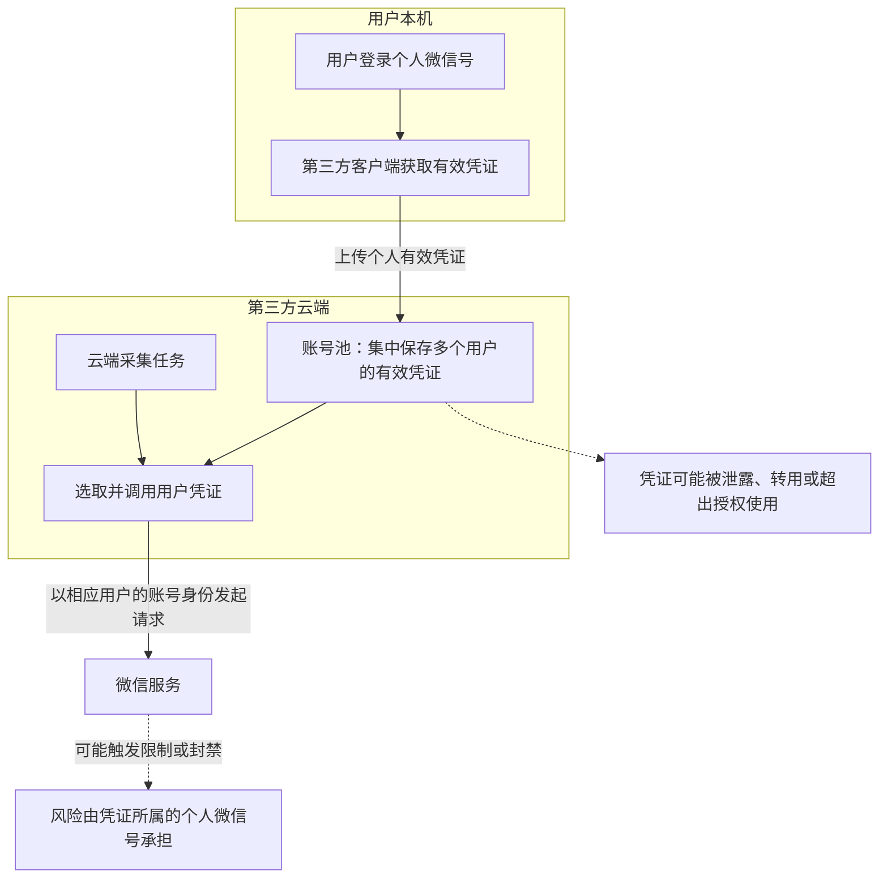
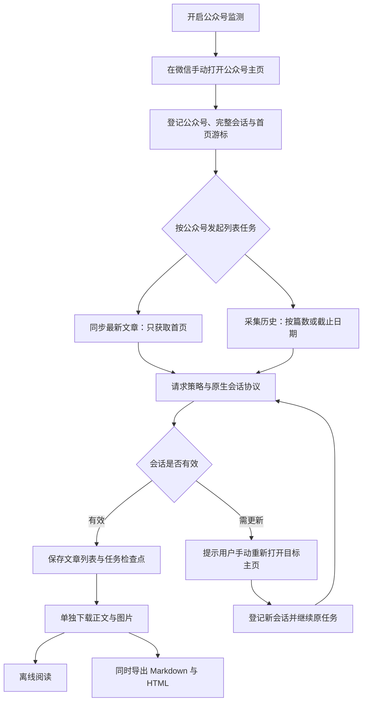

# MPider · 公众号采集工作台

在自己的 Windows 电脑上采集微信公众号文章，保存正文与图片，离线阅读，并同时导出 **Markdown 和 HTML**。

使用已登录的微信会话，通过当前 Windows 原生列表与会话协议采集。公众号监测、列表采集和正文下载分别控制，文章与任务进度保存在本机。

> [!WARNING]
> **所有需要使用个人微信号的客户端，都可能存在封号风险，MPider 也不例外。** 无论是扫码登录、读取已登录会话，还是通过其他方式使用个人微信号，本地运行、开源、低频请求或使用账号池，都不代表账号安全，也无法保证不被封号。使用前请充分评估风险，避免使用承载重要联系人、工作或支付用途的账号。
>
> **警惕将个人微信有效凭证上传云端的“账号池”。** 第三方掌握有效凭证后，可能在凭证权限与有效期内，以你的账号身份从云端发起请求；这些请求可能并非由你本人操作，却让你的账号承担限制、封禁及隐私泄露风险。**本项目反对隐瞒凭证上传、未经同意或超出授权使用个人账号的行为。**
>
> **未开源的客户端，请谨慎使用；宣称开源，也要警惕“假开源”。** 如果只公开界面或外围代码，却不公开核心采集逻辑，仍以“开源客户端”让用户相信采集行为可被核查，就属于这里所说的“假开源”。尤其需要核查凭证如何获取、保存、使用，以及是否上传云端。**有公开仓库，不等于核心逻辑已公开，更不等于下载的安装包与源码一致或使用安全。**

[下载客户端](https://github.com/areyoubugcoder/mpider/releases/latest) · [全部版本](https://github.com/areyoubugcoder/mpider/releases) · [使用说明](docs/windows-standalone.md) · [常见问题](docs/faq.md) · [反馈问题](https://github.com/areyoubugcoder/mpider/issues/new/choose) · [演示视频](https://xhslink.cn/o/4uEpUqA9P13) · [进群交流](https://qm.qq.com/q/s4JavFxA3e)

> **v1.0.0 · Windows x64 正式开源版**。当前仅验证微信 **4.1.15.56 x64** 的模块与函数指纹；微信升级后需要重新适配。macOS、Linux 不支持本次原生采集。

## 什么是账号池？有什么风险？

这里提醒的**“账号池”**，指客户端收集用户个人微信号的有效凭证，将其上传并集中保存在第三方云端，再由云端调用这些凭证，以相应用户的账号身份发起采集请求。**关键在于：个人有效凭证离开了用户本机，第三方获得了使用这些凭证发起请求的能力。**

这类凭证不一定是微信密码，也可能是会话密钥、令牌等身份凭证；具体可用于哪些请求，取决于凭证本身的权限与有效期。用户在客户端发起一次操作，不代表其凭证在云端只会用于这一次操作。


```mermaid
flowchart TD
    subgraph L[用户本机]
        U[用户登录个人微信号] --> C[第三方客户端获取有效凭证]
    end
    C -->|上传个人有效凭证| P
    subgraph S[第三方云端]
        P[账号池：集中保存多个用户的有效凭证]
        T[云端采集任务] --> D[选取并调用用户凭证]
        P --> D
    end
    D -->|以相应用户的账号身份发起请求| W[微信服务]
    W -.->|可能触发限制或封禁| R[风险由凭证所属的个人微信号承担]
    P -.-> E[凭证可能被泄露、转用或超出授权使用]
```

- **请求由云端发起，账号风险由用户承担**：用户未必知道凭证被用于哪些任务、调用多少次；异常请求仍可能导致个人微信号被限制或封禁，账号池不提供防封保证。
- **凭证上传后，使用范围难以核实**：用户难以独立确认云端是否复制、共享凭证，是否用于其他人的任务，以及是否在用户停止使用后继续调用。关闭本地客户端，不等于云端凭证已被删除或失效。
- **集中保存放大泄露风险**：云端一旦泄露或凭证被滥用，可能同时影响多个用户，并暴露凭证权限范围内可访问的数据。

**MPider 使用本机已登录的个人微信会话，不将个人微信凭证上传到云端账号池，但本地使用同样存在封号风险。默认请求间隔与预算只是本地控制措施，不是平台认可的安全额度，也不是防封承诺。**

## 闭源与“假开源”客户端，为什么要谨慎？

客户端运行在自己的电脑上，不代表个人凭证一定留在本机。**对于未开源的客户端，用户难以通过源码核查核心采集行为，请谨慎使用，不要仅凭“本地运行”或“安全防封”等宣传交出个人微信凭证。**

即便项目宣称开源，也应检查是否公开了以下内容：

- **核心采集逻辑**：实际发起请求、调用微信协议的实现是否公开，还是只有界面，关键功能仍依赖不公开的程序或云端服务。
- **凭证处理逻辑**：凭证如何获取、保存、使用和失效，是否上传到第三方服务器、进入账号池，是否存在未说明的外部调用。
- **客户端与源码的对应关系**：是否有对应版本的完整源码、依赖和构建说明，能否据此构建客户端并核查发布包的来源。

**只公开外围代码，却将未公开核心采集逻辑的客户端宣传为可完整核查的开源软件，属于本项目提醒用户警惕的“假开源”。完整开源有助于审查，但仍不是没有凭证泄露风险或封号风险的保证。**

## 软件截图

以下截图来自本版本前端，使用虚构公众号与演示文章展示操作，不代表真实账号或实际采集结果。

**公众号：先监测登记，再按公众号同步首页、采集历史、下载正文。**


**文章库：按公众号筛选，下载后阅读，同时导出 Markdown 和 HTML。**


**任务：分别管理首页同步、历史采集与正文下载，暂停后保留进度。**


## 可以做什么

| 功能 | 使用方式 |
| --- | --- |
| 公众号监测 | 开启后在微信手动打开公众号主页，登记公众号与会话；监测本身不入库文章 |
| 同步最新文章 | 每个公众号单独获取首页，去重入库，不改变历史检查点 |
| 采集历史文章 | 按追加篇数或截止日期创建任务，支持暂停和检查点续采 |
| 更新会话后续采 | 按提示手动打开目标主页，完整新会话到齐后继续原任务 |
| 正文与图片下载 | 单篇、勾选或整号加入统一持久化队列，跳过已有正文 |
| 离线阅读与导出 | 同时生成 Markdown、HTML、双格式索引、已保存图片和缺图清单 |
| 请求与任务管理 | 分别配置列表、正文和图片的间隔、并发与预算，查看请求记录和系统日志 |
| 客户端更新 | Windows 安装版检查 GitHub 正式版本，预下载并验签，确认后安装与重启 |

列表默认每页 10 条，可切换 20 / 50 / 100 条。底栏显示监测状态与活动任务进度，点击进度进入对应任务标签。游标实验室默认隐藏，可在系统设置中开启。

暂不采集视频、音频、评论、阅读量和互动数据。不提供云端托管、无人登录的 Windows 服务或自动唤醒。

## 下载与安装

环境要求：**Windows 10/11 x64**、[WebView2 Runtime](https://developer.microsoft.com/microsoft-edge/webview2/) 和已登录的 **微信 4.1.15.56 x64**。首次登记公众号与更新会话时，桌面需要解锁且可交互。

在 [GitHub Releases](https://github.com/areyoubugcoder/mpider/releases/latest) 选择：

| 下载文件 | 用途 |
| --- | --- |
| `MPider_1.0.0_x64-setup.exe` | 推荐，NSIS 安装版，支持应用内更新 |
| `MPider_1.0.0_x64_zh-CN.msi` | 中文 MSI 安装版 |
| `MPider-v1.0.0-windows-x64.zip` | 便携版，完整解压后运行 `MPider.exe`，保留旁边的 `runtime/` |
| `SHA256SUMS` | 核对下载文件的 SHA-256 |

三个客户端包均携带 Python **3.12.10**、Frida **17.23.3**、cryptography **50.0.2** 及所需许可，无需另外安装 Python、Node.js、pnpm 或 Rust。微信和 WebView2 需要自行安装。不要只复制便携包内的 EXE。

安装包附带应用更新签名，用于 MPider 验证更新文件；它不等同于 Windows 开发者代码签名，系统仍可能提示发布者未知。可先核对附件摘要：

```powershell
Get-FileHash .\MPider_1.0.0_x64-setup.exe -Algorithm SHA256
```

## 开始采集

1. **登记公众号**：打开 MPider，在「公众号」页开启「公众号监测」，再到微信手动打开目标公众号主页，等待名称与会话登记。此时不会自动采集文章。
2. **获取文章列表**：在对应公众号行点击「同步最新文章」获取首页；需要历史内容时，点击「采集历史文章」，选择追加篇数或截止日期。
3. **处理会话更新**：任务提示需要新会话时，按提示在微信重新打开或刷新该公众号主页。完整会话到齐后会沿原任务继续，程序不会替你点击微信窗口。
4. **下载正文**：在公众号行点击「下载全部正文」，或在文章库下载单篇、勾选文章。下载包括正文、封面与正文图片，已保存正文自动跳过。
5. **阅读与导出**：已下载文章显示「阅读 / 导出」。单篇、批量和整号均同时导出 Markdown 与 HTML；批量或整号导出前，先完成全部目标正文下载。

首页同步、历史采集、正文下载在「任务」的三个标签中分别管理。关闭窗口后应用留在托盘，任务继续运行；从托盘退出才停止程序。重启后未完成任务保留检查点并暂停，由你选择继续。

升级前备份「系统设置」显示的完整数据目录。便携版的数据也存放在应用数据目录，通常不在 EXE 旁；只备份数据库会遗漏正文、图片和受保护会话文件。便携版迁移到安装版及更新操作见[客户端更新说明](docs/app-updates.md)。

## 当前采集方案


```mermaid
flowchart TD
    A[开启公众号监测] --> B[在微信手动打开公众号主页]
    B --> C[登记公众号、完整会话与首页游标]
    C --> D{按公众号发起列表任务}
    D --> E[同步最新文章：只获取首页]
    D --> F[采集历史：按篇数或截止日期]
    E --> G[请求策略与原生会话协议]
    F --> G
    G --> H{会话是否有效}
    H -->|有效| I[保存文章列表与任务检查点]
    H -->|需更新| J[提示用户手动重新打开目标主页]
    J --> K[登记新会话并继续原任务]
    K --> G
    I --> L[单独下载正文与图片]
    L --> M[离线阅读]
    L --> N[同时导出 Markdown 与 HTML]
```

Tauri / React 提供界面，Rust 管理 SQLite、调度、请求策略和本地归档。Python / Frida 在本机观察已登录微信的原生列表调用；获取会话后，工作进程构造与验证协议请求，Rust 原子保存文章、游标和任务进度。首页同步和历史采集分别维护进度，会话更新后可沿检查点继续。

**使用当前工作台不需要安装根证书、修改系统代理、标定点击坐标或配置种子链接。** 详细流程见[实现原理](docs/how-it-works.md)和[协议说明](docs/wechat-session-protocol.md)。

## 请求控制与适配范围

初始列表间隔为 **90–120 秒**，滚动 24 小时预算 **60 次**；正文与图片初始间隔各 **1 秒**，并发各 **4**。这些是本地默认配置，**不是已证明安全的平台配额**，可在「限流配置」自行调整，见[频率与预算说明](docs/request-policy.md)。

微信可能要求验证、使会话失效、限制请求或账号。Frida 附加已有导致微信退出的记录，长期稳定性仍需验证。程序遇到不匹配的模块或函数指纹会停止，不能仅改微信版本号强行适配。出现验证或频率限制时应停止任务并查看日志。

会话有效期与游标可复用时间分别判断；会话过期时应更新会话，再判断历史检查点是否可继续使用，不承诺统一有效期。真实采集、长期稳定性、安装升级分别验证；每个版本的发行验收结果见 [GitHub Releases](https://github.com/areyoubugcoder/mpider/releases)。

## 数据与隐私

文章、设置、请求账本、日志与任务进度保存在本机，无需注册 MPider 账号，不自动向维护者上传文章库或诊断材料。会话密钥、原始游标与协议证据由当前 Windows 用户的 DPAPI 保护；普通文章导出不读取受保护会话文件。这些文件不能直接跨 Windows 用户使用，正文和导出文件本身不加密。

采集会访问微信服务及文章图片来源。底栏广告在启动及每 30 分钟从 GitHub 读取公开配置；启用应用更新的正式构建启动时检查公开版本清单，不自动下载或安装。上述检查不附带本地账号、Cookie、会话或文章库，GitHub 仍会收到 IP 等常规网络信息。外部产品、原文和反馈链接在点击后通过系统浏览器访问，详见[广告说明](docs/advertisements.md)。

反馈前请检查并脱敏日志；不要上传数据库、`workbench/private/`、会话文件或原始抓包。安全问题见[安全政策](SECURITY.md)。只获取和保存你有权处理的内容，文章版权归原作者及权利人所有。

## 后续 TODO

以下为计划方向，尚未实现；优先级与范围会随使用反馈调整。

- [ ] **自动化采集**：按公众号配置定时同步、增量采集与正文下载，支持暂停、预算控制和会话过期提醒。
- [ ] **优化导出**：完善目录与文件命名、文章筛选、增量导出、索引和缺图处理，提升批量导出的可读性。
- [ ] **采集稳定性**：改进会话恢复、异常分类与长时间运行验证，持续适配新版微信。
- [ ] **任务体验**：优化批量操作、进度展示、失败重试与诊断信息。
- [ ] **数据管理**：完善备份恢复、归档迁移和本地存储清理。

## 开发与贡献

开发需要 Node.js **24+**、**pnpm**、Rust stable；Windows 构建还需 Visual Studio C++ Build Tools 与 Windows SDK。改动在独立 Git worktree 中进行：

```sh
pnpm install --frozen-lockfile
pnpm exec tsc --noEmit -p frontend/tsconfig.json
pnpm build
pnpm test
cargo fmt --all -- --check
cargo clippy --locked --workspace --all-targets -- -D warnings
cargo test --locked -p mpider-core -p article-md -p mpider-tauri
pnpm tauri dev
```

Windows 测试 runner、Python 离线测试和完整客户端构建见[Windows 构建说明](docs/windows-standalone.md)。日常 CI 在 PR 中按改动路径选择前端、Windows Rust、原生桥或 CI 配置检查，合并到 main 后不重复执行；纯公开资料只运行轻量路径判断与汇总，编入界面的更新记录、FAQ、实验室与请求策略文档仅触发前端检查。共享契约改动联动验证，手动触发可运行全部检查，详细规则见[贡献指南](CONTRIBUTING.md)。客户端发行仅面向 Windows x64，标签必须与项目版本一致，完成构建、离线测试、便携包解压自检与签名清单生成后创建 Release 草稿。

[贡献指南](CONTRIBUTING.md) · [实现原理](docs/how-it-works.md) · [更新记录](CHANGELOG.md) · [第三方声明](THIRD-PARTY-NOTICES.md)

本项目以 [MIT](LICENSE) 开源。

希望持续订阅公众号更新，可了解 [mp2rss](https://mp2rss.bugcode.dev/)；需要历史文章下载服务，可了解[公众号历史文章下载](https://mphistory.followto.us/)。它们是独立外部服务，点击入口不会附带 MPider 本地会话或文章库。
